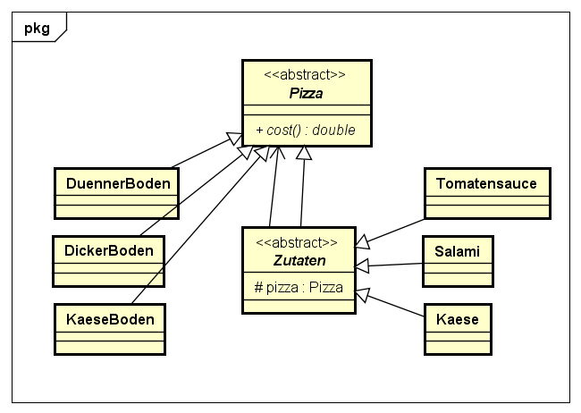

# Decorater Pattern

## Erklärung

Mit dem Decorator Entwurfsmuster kann man auf einfache Art eine bestehende Klasse um eine Funktionalität erweitern, ohne diese Klasse verändern zu müssen. Man kann auch Decorators von Decorators von Decorators machen, um beliebig viele Zusatzfunktionen ineinander zu verschachteln.

## Beispiel

Es soll der Preis einer selbsterstellten Pizza ermittelt werden.



## Code-Example

```Java
public abstract class Pizza {

	public abstract double cost();

}
```

```java
public class DickerBoden extends Pizza {
	public double cost(){
		return 2.00;
	}

}
```

```java
public class DuennerBoden extends Pizza {
	public double cost(){
		return 1.00;
	}

}
```

```java
public class KaeseBoden extends Pizza {
	public double cost(){
		return 3.00;
	}
}
```

```java
public abstract class Zutaten extends Pizza {

	protected Pizza pizza;
	public abstract double cost();
	
}
```

```java
public class Tomatensauce extends Zutaten {

	public Tomatensauce(Pizza pizza){
		this.pizza = pizza;
	}

	public double cost(){
		return this.pizza.cost() + 0.50;
	}
}
```

```java
public class Kaese extends Zutaten {

	public Kaese(Pizza pizza){
		this.pizza = pizza;
	}

	public double cost(){
		return this.pizza.cost() + 0.60;
	}

}
```

```java
public class Salami extends Zutaten {

	public Salami(Pizza pizza){
		this.pizza = pizza;
	}
	public double cost(){
		return this.pizza.cost() + 0.80;
	}

}
```

Verschiedene Pizzas können erstellt werden. Salamipizza wurde erstellt und ausgegeben werden die Kosten der Pizza.

```java
public class Main{
	public static void main(String[] args){
	
	Pizza salamiPizza = new Salami(new Tomatensauce(new KaeseBoden()));
	
	System.out.println(salamiPizza.cost());
	}
}
