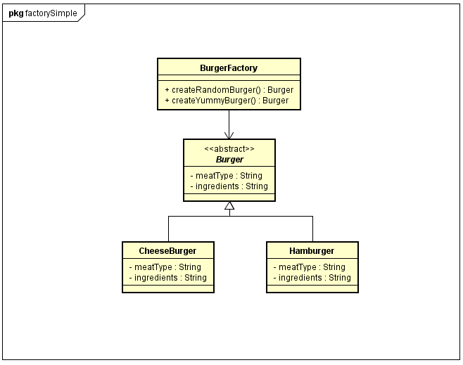

## Factory Pattern


Zum erstellen eines Objekts braucht man mehr Code als nur new. Wenn man ein Objekt mit dem genau gleichen Ablauf mehrmals erstellen muss, fällt einem auf, dass man gegen den ersten Grundsatz von Patterns verstöst: Veränderbares von unveränderbarem Trennen.

### Beispiel

Es sollen automatisch Burger erstellt werden. Einmal sollen sie zufällig erstellt werden und einmal logisch.

## Simple Factory 

### Lösung

Es gibt eine Klasse die 'über' alle anderen steht also nichts erbt oder implementiert.
Diese Klasse hat unsere 2 Methoden.
### UML



### Code Beispiel

```java
public class BurgerFactory{

    public Animal getRandomAnimal(){
        int rnd = (int) Math.random() * 2;

        if(rnd == 3){
            return new Hamburger();
        }else if(rnd == 2){
            return new Cheeseburger();
        }
    }

    private String nextBurger;

    public Ainimal getYummyBurger(){
        if(nextAnimal == "Cheeseburger"){

            nextAnimal = "Hamburger";
            return new Cheeseburger();

        }else if(nextAnimal == "Hamburger"){

            nextAnimal = "Cheeseburger";
            return new Hamburger();
    }
}
```

## Factory Method

### Lösung

Ähnlich wie bei der Simple Factory nur sind jetzt die Methoden die in der Burgerfactory waren
eigene Klassen die das BurgerFactory Interface verwenden.


### UML


### Code Beispiel

```java
public interface BurgerFactory{
    public Burger createBurger();
}

public class RandomBurger implements BurgerFactory{
    
    @Override
    public Burger createBurger(){
        int rnd = (int) Math.random() * 2;

        if(rnd == 2){
            return new Hamburger();
        }else if(rnd == 1){
            return new Cheeseburger();
        }
    }
}

public class YummyBurger implements BurgerFactory{

    private String nextBurger;

    @Override
    public Burger createBurger(){
        if(nextBurger == "Cheeseburger"){

            nextAnimal = "Hamburger";
            return new Cheeseburger();

        }else if(nextBurger == "Hamburger"){

            nextAnimal = "Cheeseburger";
            return new Hamburger();

        }
    }

}
```

## Abstract Factory

Das Abstract Factory Pattern ist eine fortgeschrittene Version des Factory Method Patterns. 
Es ist eine Verbindung von mehreren Factory Method Patterns in einer Abstract Factory.


### Beispiel

Wie bei dem Simple Factory Pattern jetzt sollen nicht nur Burger erstellt werden sondern auch noch Hot Dogs.

### Lösung

Es wird jetzt ein Interface erstellt, welches die Hotdog und BurgerFactory verknüpft nennen wir es Restaurant.

### UML


### Code Beispiel

 ```java
 public interface Restaurant{
    public Organism createYummy();
    public Organism createRandom();
}

public class BurgerFactory implements Restaurant{

    private String nextBurger;
    
    @Override
    public Burger createRandom(){
        int rnd = (int) Math.random() * 2;

        if(rnd == 2){
            return new Hamburger();
        }else if(rnd == 1){
            return new Cheeseburger();
        
    }

    @Override
    public Burger createYummy(){
        if(nextBurger == "Hamburger"){

            nextAnimal = "CheeseBurger";
            return new Hamburger();

        }else if(nextBurger == "Cheeseburger"){

            nextBurger = "Hamburger";
            return new Cheeseburger();

        }
    }
}

public class HotdogFactory implements Restaurant{

    private String nextHotdog;

    @Override
    public Tree createRandom(){
        int rnd = (int) Math.random() * 2;

        if(rnd == 2){
            return new HawaiiHotdog();
        }else if(rnd == 1){
            return new HotHotdog();
        }
    }

    @Override
    public Tree createYummy(){
        if(nextHotdog == "HawaiiHotdog"){

            nextTree = "HotHotdog";
            return new HawaiiHotdog();

        }else if(nextHotdog == "HotHotdog"){

            nextTree = "HawaiiHotdog";
            return new HotHotdog();

        }
    }

}
```