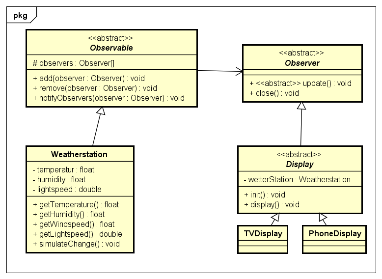

# Observer Pattern

## Erklärung

Das Observer Pattern ist ein verhaltensorientiertes Software Design Pattern. Dabei ist das Verhalten eines Observer Pattern auf die Prozesse eines Softwaresystems ausgerichtet. Damit steuert das Konzept des Observersdesigns effektiv Updates und Statusänderungen für eine Vielzahl von Prozessen.

Wenn viele zu überwachende Objekte ein regelmäßiges Update erfordern, und auf den Status von Softwareelementen viele Änderungen erfolgen, ist das Observer Pattern von Nutzen. Solche häufigen Statusupdates ergeben sich immer dann, wenn Attributwerte (Variablen) sich in hoher Frequenz verändern.

## Beispiel

Es wird eine Wetterstation aufgestellt die Wetterdaten misst.



## Code-Example

```java
public abstract class Observable {

	protected ArrayList<Observer> observers = new ArrayList();


	public void add(Observer observer) {
		this.observers.add(observer);
	}

	public void remove(Observer observer) {
		this.observers.remove(observer);
	}

	public void notifyObservers(Observer observer) {
		for(int i = 0; i < observers.size(); i++){
			observers.get(i).update();
			
		}
	}
}
```

```java
public abstract class Observer {

	public void update() {

	}

	public void close() {

	}

}
```

```java
public class Weatherstation extends Observable {

	private float temperature;
	private float humidity;
	private double lightspeed;

	public float getTemperature() {
		return temperature;
	}

	public float getHumidity() {
		return humidity;
	}

	public float getWindspeed() {
		return windspeed;
	}

	public double getLightspeed() {
		return lightspeed;
	}

	public void simulateChange() {
	
		this.temperature = (int) (Math.random() * 50);
        this.humidity = (int) (Math.random() * 100);
        this.windspeed = (int) (Math.random() * 250);
		this.lightspeed = lightspeed + (Math.random() * -0.1);
        notifyObservers();
    
	}

}
```

```java
public abstract class Display extends Observer {

	protected Weatherstation weatherStation;

    protected void init(WeatherStation weatherStation){
        this.weatherStation = weatherStation;
        this.weatherStation.add(this);

        this.update();
    }

	public void close(){
		this.weatherStation.remove(this);
    }
	
	 public void update(){

        display(weatherStation.getTemperature(), weatherStation.getHumidity(), weatherStation.getWindspeed(), weatherStation.getLightspeed());
    
	
	}
	public abstract void display(float temperature, float humidity, double lightspeed,float windspeed);
}
```

```java
public class PhoneDisplay extends Display{

	public PhoneDisplay(WeatherStation weatherStation){
		this.init(weatherStation);

	}
	
	public void display(){
	}
}
```

```java
public class TVDisplay extends Display{

    public TVDisplay(WeatherStation weatherStation){
        this.init(weatherStation);
    }
	
	public void display(){
	}
}
```

```java
public class Main {

    public static void main(String[] args) {
        WeatherStation w = new WeatherStation();
        w1.simulateChange();

        TVDisplay tv = new TVDisplay(w);
        PhoneDisplay phone = new PhoneDisplay(w);

        w.simulateChange();
        tv.close();
        phone.close();
    }
}
```