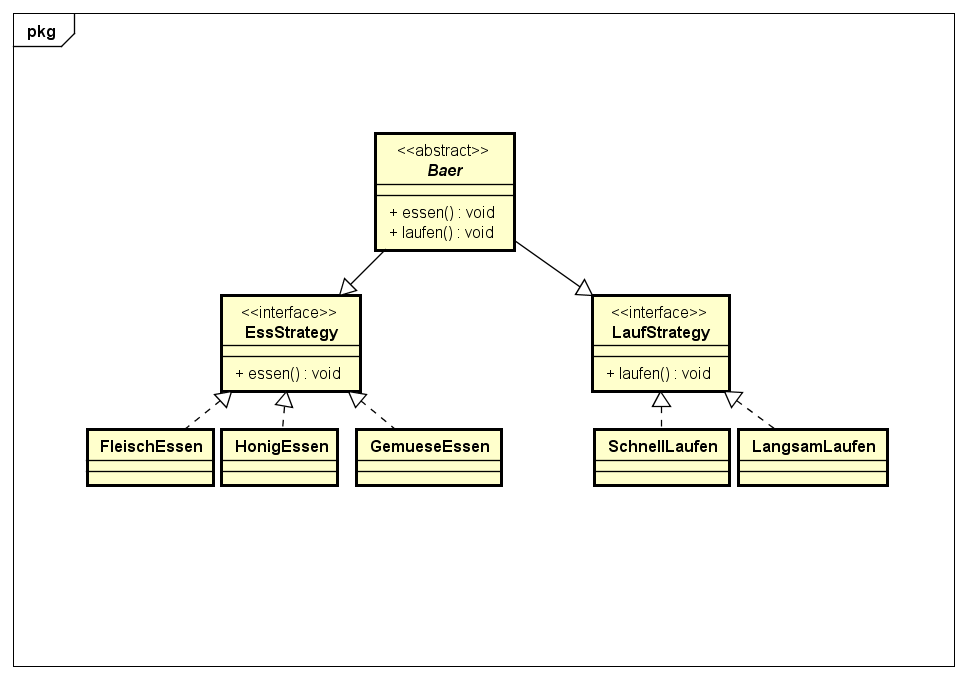

# Strategy Pattern

## Erklärung

Das Strategy Pattern ist ein verhaltensorientiertes Softwaredesign-Entwurfsmuster, dass zur Lösung einer bestimmten Aufgabe unterschiedliche Strategien nutzt. Jede wählbare Strategie in einem Strategiepattern bildet damit einen eigenständigen Lösungsweg zur algorithmischen Bearbeitung.

Die digitalen Strategien in Strategy-Pattern entsprechen unterschiedlichen Algorithmen unter denen Strategypattern den jeweils optimalen Algorithmus zur Lösungsbearbeitung auswählen. Der Prozess der Strategiefindung von Strategypattern geschieht dabei zur Laufzeit, so dass die Algorithmenwahl während der Programmausführung stattfindet. 

## Beispiel:

Es sollen verschiedene Bären modelliert werden die verschiedene Verhaltensweisen, zu laufen und essen aufweisen. Jeder Bär soll essen und laufen können.



## Code-Example

```java
public abstract class Baer {

	private LaufStrategy laufStrategy;
	private EssStrategy essStrategy;
	
	public Baer(LaufStrategy laufStrategy, EssStrategy essStrategy){
		
		this.laufStrategy = laufStrategy;
		this.essStrategy = essStrategy;

	public void essen() {
		this.essStrategy.essen();
	}

	public void laufen() {
		this.laufStrategy.laufen();
	}

}
```

```java
public interface EssStrategy {

	public void essen();
		
}
```

```java
public class FleischEssen implements EssStrategy {
	
	@Override
	public void essen() {

	}
	
}
```

```java
public class GemueseEssen implements EssStrategy {

	@Override
	public void essen() {

	}

}
```

```java
public class HonigEssen implements EssStrategy {

	@Override
	public void essen() {

	}

}
```

```java
public interface LaufStrategy {

	public void laufen();

}
```

```java
public class LangsamLaufen implements LaufStrategy {

	@Override
	public void laufen() {

	}

}
```

```java
public class SchnellLaufen implements LaufStrategy {

	@Override
	public void laufen() {
		

	}

}
```

In der Main Methode wurde ein Panda erstellt, der langsam laufen kann und gemuese isst.

```java
public class Main{
	public static void main(String[] args){
	
		LaufStrategy langsam = new LangsamLaufen();
		EssStrategy gemuese = new GemueseEssen();
		Baer pandabaer = new Baer(langsam, gemuese);
		
		pandabaer.laufen();
		pandabaer.essen();
	}

}